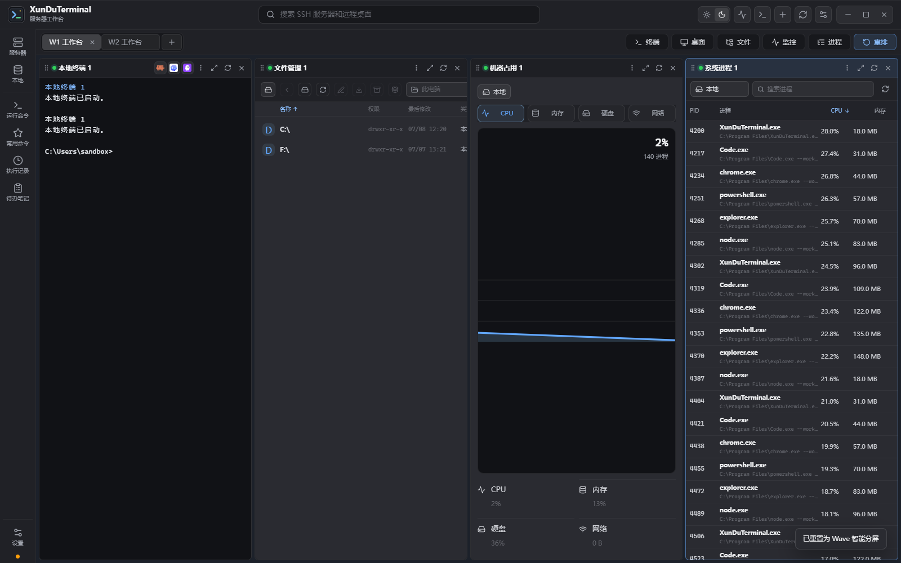
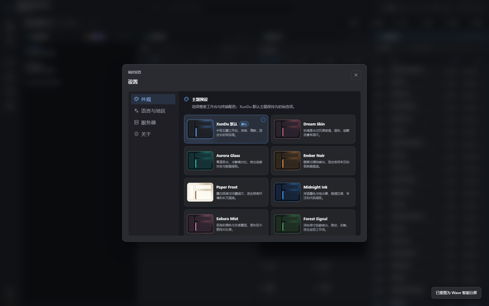

# XunDuTerminal

**简体中文** · [English](README_EN.md)

XunDuTerminal 是一款面向 Windows 的开源服务器工作台，将 SSH 终端、文件管理、系统监控、进程查看和原生远程桌面集中在可持久化的多工作区中。

[源码仓库](https://github.com/KaiGe7384/XunDuTerminal) · [版本下载](https://github.com/KaiGe7384/XunDuTerminal/releases) · [问题反馈](https://github.com/KaiGe7384/XunDuTerminal/issues)

<p align="center">
  
</p>

<p align="center"><sub>终端、文件管理、资源监控与系统进程可在同一工作区自由组合。截图使用安全沙箱数据。</sub></p>

> 当前版本为 `v0.1.0` 预发布版。Windows 安装包尚未进行 Authenticode 签名，系统可能显示 SmartScreen 提示；测试前请备份重要的连接配置。

## 功能亮点

- 多工作区持久化布局，支持面板拖动、缩放和排列。
- 基于 xterm.js 的本地终端与 SSH 终端。
- 支持密码、私钥和 SSH Agent 认证。
- 支持粘贴连接信息以及从 `~/.ssh/config` 导入配置。
- SFTP 文件浏览、编辑、拖放上传、下载进度和右键操作。
- CPU、内存、磁盘、网络和进程监控。
- 原生 RDP 会话、动态分辨率、剪贴板文本和文件传输。
- 深色/浅色外观、八套文件化主题、自定义壁纸与整体透明度。
- 简体中文与英文界面、可调终端字号和减少动态效果支持。

### 主题与外观

<p align="center">
  
</p>

八套主题预设覆盖深色、浅色与玻璃质感方向；主题、终端配色、壁纸和透明度可以统一配置。

## 支持平台

| 平台 | 当前状态 |
| --- | --- |
| Windows 10 / 11 x64 | 已支持，Release 提供 NSIS EXE 与 MSI 安装包 |
| iOS / iPadOS | 规划中，当前版本不可用；需要移动端交互、原生能力和 Apple 签名适配 |
| macOS / Linux / Android | 尚未提供正式构建 |

XunDuTerminal 当前包含 Windows Credential Manager、ConPTY、本地进程管理和原生 RDP 剪贴板等桌面能力，因此不能仅通过切换 GitHub Actions runner 就得到可用的 iOS 应用。

## 下载与校验

前往 [Releases](https://github.com/KaiGe7384/XunDuTerminal/releases) 下载最新预发布版本。每个版本同时提供 `SHA256SUMS.txt`，可在 PowerShell 中校验安装包：

```powershell
Get-FileHash .\XunDuTerminal_0.1.0_x64-setup.exe -Algorithm SHA256
```

将输出与 `SHA256SUMS.txt` 中对应文件的哈希值进行比较。

## 安全说明

- SSH 与 RDP 密钥信息存储在 Windows 凭据管理器中。
- 浏览器存储、工作区快照和导出的服务器 JSON 不包含密码。
- 旧版明文浏览器凭据会先迁移，再删除明文副本。
- SSH 辅助连接遵循用户的 OpenSSH `known_hosts`，首次连接可接受新密钥，密钥不匹配时会阻止连接并要求确认。
- 诊断内容会尽量移除凭据、服务器地址和本地路径；若发现意外泄露，请通过安全渠道报告。

漏洞报告与当前支持策略请查看 [SECURITY.md](SECURITY.md)。

## 本地开发

### 环境要求

- Windows 10 或 Windows 11
- Node.js 24+
- Rust 1.89+
- Microsoft WebView2 Runtime
- Windows OpenSSH Client

### 运行

```powershell
npm ci
npm run desktop:dev
```

### 验证

```powershell
npm run lint
npm run build
npm run test:native
npx playwright install chromium
npm run test:sandbox
```

### 打包

```powershell
npm run desktop:build
```

Tauri 原生构建产物位于 `src-tauri/target/release/bundle/`。

## 项目结构

- `src/`：React 界面、工作区、xterm 渲染器、持久化和沙箱桥接。
- `Skin/`：自动发现的纯数据主题与 JSON Schema；自制主题请查看 [Skin/README.md](Skin/README.md)。
- `src-tauri/src/`：本地终端、SSH/SFTP、系统监控、凭据存储和 RDP 命令。
- `src-tauri/vendor/`：项目内维护的 IronRDP 剪贴板适配。
- `tools/`：Playwright 沙箱回归与性能辅助脚本。
- `docs/`：架构与功能专项文档。
- `docs/UPDATES.md`：更新清单格式和官方发布链接规则。

## 贡献

提交 Pull Request 前请阅读 [CONTRIBUTING.md](CONTRIBUTING.md)。Issue、日志和截图中请勿包含密码、私钥、访问令牌或未经脱敏的服务器信息。

## 社区与服务

- 企业级服务器：[讯度云](https://xunduyun.com/)
- 技术 QQ 交流群：`1090339570`
- 技术 QQ 交流二群：`262430517`

## 开源许可

XunDuTerminal 基于 [MIT License](LICENSE) 开源。第三方组件保留各自许可，详见 [THIRD_PARTY_NOTICES.md](THIRD_PARTY_NOTICES.md)。
